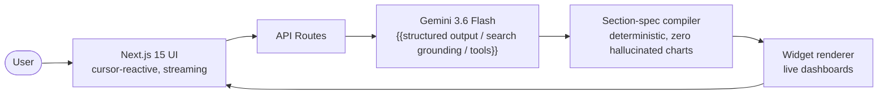

<!-- ═══════════════════════════════════════════════════════════════════
  JURY-FACING README TEMPLATE — fill every {{...}} within the first hour
  of the hackathon and keep it current as features land (rapid-mvp §5).
  Kit/prep instructions live in KIT.md, not here.
════════════════════════════════════════════════════════════════════ -->

<div align="center">

# {{PROJECT_NAME}}

### {{One-line pitch: the user pain + what this does about it, ≤15 words}}

[]({{VERCEL_URL}})
[](https://ai.google.dev)
[](https://hack2skill.com)

{{Hero screenshot or GIF of the app — capture with Cmd+Shift+5, drop in `public/hero.png`}}


**[Try it live]({{VERCEL_URL}})** · Scan to open on your phone:


</div>

---

## The problem

{{2-3 sentences. Who hurts, how badly, and why current options fail them.
Concrete beats abstract: "A floor supervisor loses 40 minutes every shift..." }}

## What {{PROJECT_NAME}} does

- 🎯 **{{Feature 1 — phrased as user value, not implementation}}**
- ⚡ **{{Feature 2}}**
- 📊 **{{Feature 3}}**
- 🔍 **{{Feature 4 — cut this line if only 3 shipped; never list unshipped features}}**

## See it in 90 seconds

1. **{{Demo beat 1: what you click → what appears}}**
2. **{{Demo beat 2}}**
3. **{{Demo beat 3 — the wow moment}}**

## How it works



{{One short paragraph: the model authors *intent* (typed section specs); deterministic
code authors *pixels* — adapt to whatever the real architecture ends up being.}}

## Built on the Google stack

| | |
|---|---|
| **Gemini 3.6 Flash** | {{main reasoning/generation — say exactly what it powers}} |
| **Gemini 3.5 Flash-Lite** | high-frequency background calls + resilience fallback ladder |
| **{{Google Search grounding / multimodal / Live API}}** | {{the capability that makes the demo special}} |
| **Google AI Studio** | API keys + prompt iteration |
| **Google Antigravity** | agentic development workflow ({{one sentence on how it was used}}) |

## Run it locally

```bash
git clone {{REPO_URL}} && cd {{REPO_DIR}}
pnpm install
cp .env.example .env.local   # add your Gemini API key from aistudio.google.com
pnpm dev                     # → http://localhost:3000
curl localhost:3000/api/health   # verify the Gemini connection
```

| Variable | Purpose |
|---|---|
| `GEMINI_API_KEY` / `GOOGLE_GENERATIVE_AI_API_KEY` | Gemini API access (same value) |
| `GEMINI_API_KEY_FALLBACK` | optional second key — 429 resilience |
| `LLM_PROVIDER` | `antigravity` locally (subscription quota), `api` when deployed |
| `MOCK` | `1` = canned fixtures, zero-token UI development |

Deploy: `pnpm dlx vercel --prod` · Docker: `docker build -t {{PROJECT_NAME}} .`

## What's next

{{One line: the most credible growth step if this went to production.}}

---

<div align="center">

Built solo in one day at **PromptWars Chennai** by **Sathya T** ([@tsathya98](https://github.com/tsathya98))
· powered by Gemini · vibe-coded with Claude Code + Google Antigravity

</div>
