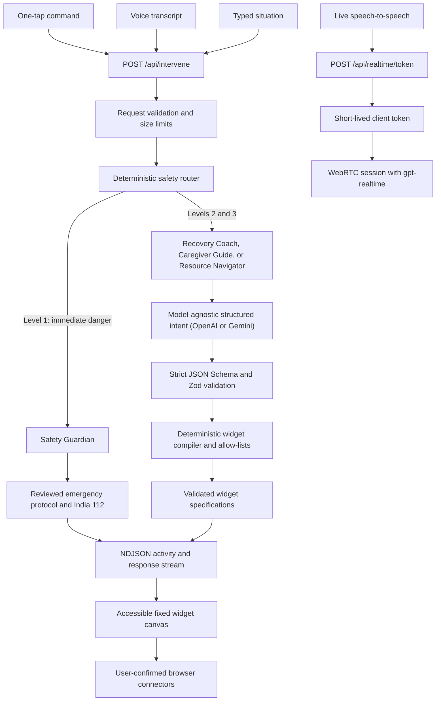

<div align="center">

# IBUKI Circle

### One breath. One tap. Your circle responds.

**A multimodal recovery and prevention platform for people navigating substance use disorders and the caregivers standing beside them.**

[](https://web-delta-three-92.vercel.app)
[](https://nextjs.org/)
[](#engineering-evidence)
[](#genai-and-technology-stack)

**[Launch the deployed application](https://web-delta-three-92.vercel.app)**

Built for the **PromptWars Chennai 2026 Recovery & Prevention challenge**.

</div>

---

## Executive summary

Most support tools expect a person in distress to explain what is happening, search through information, and decide what to do next. Those are exactly the tasks that become hardest during a craving, panic episode, return to use, or suspected overdose.

**IBUKI Circle turns one tap, a spoken phrase, or a short message into an immediate and actionable support flow.** It serves both the person seeking help and the caregiver supporting them. Generative AI personalizes recovery and caregiver guidance, while deterministic code controls emergency routing, verified resources, rendered UI, and every real-world action.

This is not a static information page and it is not an unrestricted chatbot. It is a working intervention pipeline with:

- **12 one-tap commands** across individual and caregiver modes;
- **two voice experiences**: speech-to-intervention and live speech-to-speech support;
- **four specialist profiles** selected by a deterministic safety router;
- **six validated recovery widgets** rendered from a closed vocabulary;
- **five consent-based connector capabilities** for calls, messages, sharing, location, and speech;
- **India-first emergency and support resources** from reviewed registries;
- **a model-independent Level 1 emergency path** for immediate danger; and
- **visible, real pipeline activity** without exposing hidden chain-of-thought.

> **Name:** *IBUKI* (息吹) is a Japanese word associated with breath and renewed vitality. The circle represents the trusted people and services around a person in recovery.

## The problem, in plain language

Substance-use recovery is not only a long-term education problem. It is also a **right-now action problem**.

When cognitive load is high:

- a person experiencing a strong urge may not be able to type a detailed prompt;
- someone panicking needs one small physical step, not a wall of text;
- a person who has returned to use needs safety and dignity, not shame;
- a caregiver may know something is wrong but not know what to say;
- a suspected overdose cannot wait for an AI response; and
- finding a trustworthy phone number should not depend on model memory.

The challenge therefore requires one connected product that combines zero-typing access, personalized scripts, contextual safety, education, caregiver guidance, and multimodal interaction. IBUKI Circle implements that full journey rather than presenting disconnected AI demos.

## What an evaluator can test immediately

| Scenario | What to do | Observable result | Runtime path |
|---|---|---|---|
| Strong craving | Tap **I'm having a strong urge** | A personalized short plan, optional paced breathing, a prepared circle message, and verified human-support actions | Deterministic routing → Recovery Coach → strict structured output |
| Panic or overwhelm | Tap **I'm panicking or overwhelmed** | Low-cognitive-load grounding steps that can be read aloud | Recovery Coach → validated widget canvas → browser speech |
| Return to use | Tap **I returned to use** | Non-stigmatizing next steps focused on immediate safety | Recovery Coach with explicit person-first rules |
| Caregiver conversation | Select **I'm supporting someone**, then tap **Help me start a conversation** | What to say, what to avoid, warning signs, and verified caregiver resources | Caregiver Guide → caregiver-specific widgets |
| Suspected overdose | Tap **Possible overdose / danger** or **Possible overdose** | The UI switches to a focused emergency view with **Call 112 now** and reviewed response steps | Level 1 Safety Guardian → deterministic verified protocol; no model call |
| Spoken intervention | Tap the microphone and speak a situation | The transcript enters the same `/api/intervene` safety pipeline as typed text | Browser speech recognition → server safety router |
| Live voice support | Open **Live voice** and start a conversation | A low-latency speech-to-speech session with visible connection, mute, retry, and end states | Short-lived server token → WebRTC → OpenAI Realtime |
| Education or resources | Ask for a helpline, treatment resource, or explanation | Plain-language guidance with resources selected only from the verified catalog | Resource Navigator → allow-listed resource IDs |

## Direct alignment with all five functional pillars

| Official challenge pillar | IBUKI Circle implementation | Evidence in the product |
|---|---|---|
| **1. Zero-Typing Interventions** | Large one-tap commands, emergency macro, browser speech recognition, live speech-to-speech, and read-aloud output | Every primary flow can begin without typing; controls are feature-detected and expose honest unsupported/error states |
| **2. Personalized Emergency Scripts** | The model creates structured intent using the selected specialist, actor mode, situation, and optional context | A single live model call produces short acknowledgements, steps, breathing parameters, caregiver guidance, and circle-message intent |
| **3. Contextual Safety Tools** | Three-level deterministic safety router, emergency phrase escalation, risk labels, verified protocols, and user-confirmed actions | Level 1 bypasses the model; urgent flows always add reviewed human-support options |
| **4. Education & Caregiver Support** | Dedicated Caregiver Guide and Resource Navigator with person-first prompts and source-restricted resources | Switch modes to receive non-blaming scripts, warning signs, self-care guidance, and official helplines |
| **5. Connected Multi-Modal Workflows** | Tap, text, voice transcript, live audio, visual widgets, speech synthesis, phone, messaging, share, and location work as connected journeys | Input is routed into a support plan; the plan becomes interactive widgets; widgets expose explicit next actions |

## Product architecture: three controlled libraries

IBUKI Circle separates AI reasoning from user interface and device actions. The orchestrator selects from three typed libraries instead of letting a model invent capabilities.

### 1. Specialist agent library

| Specialist | Selected for | May produce |
|---|---|---|
| **Safety Guardian** | Suspected overdose, breathing danger, unresponsiveness, self-harm language, or the emergency button | Verified safety actions, emergency script, circle message, and reviewed resources |
| **Recovery Coach** | Cravings, panic, feeling close to use, return to use, or needing someone | Immediate intervention steps, breathing guide, circle message, helplines, and recovery resources |
| **Caregiver Guide** | Distress support, conversation preparation, caregiver wellbeing, and warning signs | Say/avoid guidance, caregiver playbooks, support message, and safety actions |
| **Resource Navigator** | Education, treatment, helpline, and recovery-resource questions | Plain-language explanation and verified resource cards |

Each specialist declares an explicit widget allow-list and connector allow-list. A specialist cannot create a new UI type, invent a phone number, or execute an action.

### 2. Widget library

| Widget | Purpose | Guardrail |
|---|---|---|
| `intervention-script` | One acknowledgement plus one to three immediate steps | Length-bounded and source-labelled |
| `breathing-guide` | Timed inhale, hold, exhale, and cycle sequence | Numeric values are clamped to safe UI ranges |
| `safety-actions` | Prioritized verified calls and emergency actions | Resource IDs must resolve through the reviewed registry |
| `circle-message` | Editable message for a trusted person | Prepared only; the user reviews and sends it |
| `caregiver-guidance` | What to say, what to avoid, and warning signs | Dedicated caregiver schema with bounded lists |
| `verified-resource` | Official helpline or reviewed educational source | Must use a known resource ID and is always labelled verified |

### 3. Connector library

| Connector capability | What it does | What it never claims |
|---|---|---|
| Phone | Opens the device dialer with a verified number | That a call connected or help arrived |
| Circle message | Opens SMS or WhatsApp, or copies an editable message | That a message was sent or delivered |
| Consent-based location | Requests browser permission and prepares a Maps link for the message | That location was shared without the user sending it |
| Read aloud | Uses browser speech synthesis at a calm pace | That unsupported browsers played audio |
| Native share | Opens the device share sheet, with clipboard fallback | That the user completed a share |

Connector results use only observable states: `prepared`, `opened`, or `failed`.

## End-to-end architecture



### Intervention request and stream

Every tap, speech-recognition transcript, and typed request uses the same compact contract:

```json
{
  "mode": "individual",
  "buttonId": "urge",
  "context": {
    "alone": true,
    "setting": "home",
    "trustedContactLabel": "My support person"
  }
}
```

`POST /api/intervene` streams newline-delimited JSON. Activity frames report the real `routing`, `generation`, `validation`, and `rendering` stages; connector controls then report their own observable result beside the action. The final response contains an agent ID, risk level, source label, model label, and one to five validated widget specifications.

## Why this is safer than a general chatbot

### Deterministic safety boundary

Emergency buttons and explicit danger phrases are checked before any model call. A Level 1 request immediately returns the reviewed emergency protocol and India’s 112 action. AI latency, model availability, or malformed output cannot block that path.

### The model authors intent, not pixels or actions

For non-emergency support, the platform is **model-agnostic**: a provider layer (`lib/model-provider.ts`) selects the primary model via `MODEL_PROVIDER` (OpenAI default, Gemini option) and automatically falls back to the other verified provider on failure. Whichever model runs, it returns a strict intent object: the provider API enforces a JSON Schema, Zod validates the parsed object again, and deterministic application code converts approved fields into a closed set of widgets. Unknown resource IDs are rejected. Each response records which model actually produced it.

### Verified fallback instead of fake AI

If live generation fails, IBUKI explicitly says that personalization is unavailable and renders source-labelled reviewed guidance and helplines. It never presents hardcoded fallback content as a successful AI response.

### Honest real-world actions

The app can prepare a message or open a dialer, but only the user can send or call. The UI reports what was actually observable and never claims delivery, contact, rescue, or location sharing.

### Visible provenance

Each response is labelled as **AI-generated**, **verified protocol**, or **AI + verified resources**. The activity rail exposes operational stages and durations, not private chain-of-thought.

## Verified safety resources

Phone numbers and safety guidance come from a versioned in-code registry reviewed for this submission. The model sees catalog IDs and cannot supply arbitrary replacements.

| Resource | Use in IBUKI Circle |
|---|---|
| [Emergency Response Support System — 112](https://112.gov.in/) | Unified emergency action for immediate danger in India |
| [National Drug De-addiction Helpline — 14446](https://nmba.dosje.gov.in/) | Counselling and treatment-service referral |
| [Tele-MANAS — 14416](https://telemanas.mohfw.gov.in/) | 24×7 tele-mental-health support |
| [CDC: Responding to a suspected overdose](https://www.cdc.gov/stop-overdose/response/index.html) | Reviewed first-response steps, localized to India’s emergency number |
| [SMART Recovery](https://smartrecovery.org/) | Reviewed urge-grounding guidance |
| [SAMHSA caregiver guidance](https://www.samhsa.gov/find-support/helping-someone) | Conversation and caregiver-support guidance |

> **Important:** IBUKI Circle is a support and navigation tool, not a medical provider, diagnosis service, or replacement for emergency care. In immediate danger in India, call **112**.

## Privacy, security, and responsible AI

- **No application database:** this hackathon build does not persist transcripts, live audio, coordinates, phone numbers, circle messages, crisis history, or health information.
- **Server-side secrets:** the standard OpenAI API key is never sent to the browser.
- **Ephemeral live-voice access:** the browser receives only a short-lived Realtime client token; the user explicitly starts and ends microphone access.
- **Consent at action time:** browser location is requested only when a user chooses to add it to a message.
- **Bounded input:** intervention requests have a 16 KB body limit and text is capped at 2,000 characters.
- **No response caching:** the intervention stream is returned with `Cache-Control: no-store`.
- **Defensive response handling:** strict schemas, length limits, numeric clamps, resource allow-lists, and widget allow-lists are applied before render.
- **Security headers:** content-type sniffing, framing, referrer, camera, microphone, and geolocation policies are configured in Next.js.
- **Automated checks:** CI uses a frozen lockfile, production dependency audit, and full-history Gitleaks scan.
- **Person-first language:** model instructions prohibit stigmatizing labels, diagnosis, medication or detox instructions, guarantees, shame, and invented helplines.

## Accessibility and high-cognitive-load design

The interface is deliberately calm, high-contrast, and action-first:

- individual and caregiver modes use clear language rather than clinical jargon;
- primary controls meet a minimum 48 px touch target, with a larger emergency action;
- emergency mode removes visual distraction and promotes one primary call action;
- keyboard focus is always visible;
- status changes use `aria-live`, with assertive announcements in emergency mode;
- motion respects `prefers-reduced-motion` and coarse-pointer devices;
- voice and speech features degrade to explicit text/button alternatives;
- AI, verified, mixed, working, failed, and confirmation-required states are never represented by color alone; and
- editable messages keep the user in control before any external action.

## GenAI and technology stack

| Layer | Technology | Why it is used |
|---|---|---|
| Personalized interventions | Model-agnostic provider layer: OpenAI Responses API (`gpt-5.6-terra`, default) or Google Gemini (`gemini-3.6-flash`) via `MODEL_PROVIDER`, with automatic cross-provider fallback | One structured model call per non-emergency intervention, optimized for latency; no single-vendor dependency |
| Live conversation | OpenAI Realtime (`gpt-realtime`) over WebRTC | Low-latency speech-to-speech with a short-lived browser credential |
| Safety and orchestration | TypeScript deterministic router and typed specialist registry | Emergency independence, predictable routing, and reviewable policy |
| Structured output | Strict JSON Schema plus Zod 4 | API-level shape enforcement followed by runtime validation |
| Application | Next.js 16 App Router and React 19 | UI, server routes, streaming, and standalone deployment |
| Styling | Tailwind CSS 4 and semantic CSS tokens | Consistent high-contrast, low-cognitive-load presentation |
| Browser capabilities | Speech Recognition, Speech Synthesis, Web Share, Geolocation, `tel:`, SMS, and WhatsApp links | Multimodal input/output and explicit user-controlled actions |
| Workspace | Nx 23 and pnpm workspaces | Repeatable task execution and cacheable checks |
| Testing | Vitest 4 | Fast focused verification of schemas, routing, compilation, emergency behavior, and connector builders |
| Deployment | Vercel, with standalone Docker support | Public evaluator access and portable production builds |

## Engineering evidence

Verified locally against the current implementation:

| Check | Current result | What it covers |
|---|---|---|
| `pnpm nx test web` | **18 tests passing across 4 test files** | Safety routing, emergency independence, schema contracts, widget compilation, fallbacks, and connector URL builders |
| `pnpm nx lint web` | **0 errors** | Next.js, React, TypeScript, hooks, and accessibility linting; two non-blocking cursor-animation warnings remain |
| `pnpm nx build web` | **Passing production build** | Next.js 16 compilation, TypeScript checking, static generation, and route construction |
| `pnpm audit --prod --audit-level=high` | **No known vulnerabilities found** | Production dependency audit |
| GitHub Actions | **Configured** | Frozen install, guidance mirror check, lint, test, production audit, build, concurrency cancellation, and secret scan |

The production application exposes:

- `/` — intervention experience;
- `/api/intervene` — validated NDJSON intervention pipeline;
- `/api/realtime/token` — short-lived credential for live voice; and
- `/api/health` — live model, latency, specialist count, resource count, and registry version check.

## Repository structure

```text
apps/web/
├── app/
│   ├── api/intervene/        # validated streaming intervention endpoint
│   ├── api/realtime/token/   # ephemeral live-voice token endpoint
│   ├── api/health/           # live model and registry health check
│   └── page.tsx              # individual, caregiver, emergency, and voice UI
├── components/               # widget canvas, voice, activity, and motion UI
└── lib/
    ├── agents/               # typed specialist registry and orchestrator
    ├── safety-router.ts      # deterministic risk routing
    ├── schemas.ts            # closed vocabularies and validation contracts
    ├── resources.ts          # reviewed safety/resource registry
    ├── connectors.ts         # user-confirmed browser actions
    └── openai.ts             # Responses API wrapper and retry policy
```

The detailed product and architecture plan is available in [`docs/07-ibuki-circle-plan.md`](docs/07-ibuki-circle-plan.md).

## Run locally

### Prerequisites

- Node.js 22
- pnpm 10
- an OpenAI API key with access to the configured models

### Setup

```bash
pnpm install
cp .env.example apps/web/.env.local
# Add OPENAI_API_KEY to apps/web/.env.local
pnpm nx dev web
```

Open [http://localhost:3000](http://localhost:3000), then verify the model connection:

```bash
curl http://localhost:3000/api/health
```

### Quality checks

```bash
pnpm nx lint web
pnpm nx test web
pnpm nx build web
pnpm audit --prod --audit-level=high
```

### Environment variables

| Variable | Required | Purpose |
|---|---:|---|
| `OPENAI_API_KEY` | Yes | Server-side credential for structured interventions, health checks, and ephemeral Realtime tokens |
| `OPENAI_BASE_URL` | No | Defaults to the required region-pinned `https://us.api.openai.com/v1` host |

There is no mock mode and no authentication wall. Evaluators can use every workflow directly in the deployed application.

## Current scope and future vision

### Working in this submission

- connected one-tap, typed, speech-recognition, read-aloud, and live-voice experiences;
- deterministic emergency routing and reviewed fallback content;
- individual and caregiver journeys;
- specialist, widget, and connector libraries;
- official India-first helplines and reviewed educational resources;
- responsive, keyboard-aware, reduced-motion-aware UI; and
- public deployment, health endpoint, automated tests, CI, and security scanning.

### Intentionally not claimed

- IBUKI does not diagnose, prescribe, supervise detoxification, or replace professional care.
- It does not autonomously call, message, share location, or contact emergency services.
- It does not claim a dialer/composer action was completed.
- It does not persist profiles, health history, contacts, transcripts, or recovery records in this build.

### Post-hackathon direction

The three-library architecture is designed to grow safely: more reviewed specialist policies, localized widget packs, and consent-based connectors can be added without giving a model unrestricted UI or device control. Persistent care plans, authenticated circles, provider integrations, multilingual localization, and human-in-the-loop clinical review are future capabilities—not features claimed by this submission.

---

<div align="center">

Built with care at **PromptWars Chennai 2026** by **Sathya T** ([@tsathya98](https://github.com/tsathya98))

**[Try IBUKI Circle live](https://web-delta-three-92.vercel.app)**

</div>
