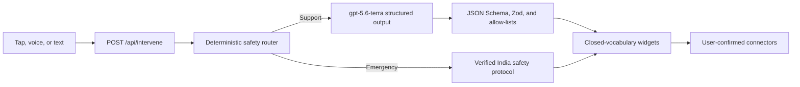

<div align="center">

# IBUKI Circle — Recovery & Prevention Platform

### Zero-typing recovery interventions, deterministic emergency guidance, and caregiver support under high cognitive load.

[](https://web-delta-three-92.vercel.app)
[](https://hack2skill.com)
[](https://openai.com)

**[Try it live](https://web-delta-three-92.vercel.app)**

</div>

---

## The problem

Individuals navigating substance use disorders and their families face overwhelming distress during acute craving peaks and crisis moments. High cognitive stress makes typing or searching for support nearly impossible. Current resources are often static, text-heavy, or require complex manual navigation when immediate de-escalation is needed most.

## What IBUKI Circle does

- **Zero-typing intervention:** one-tap commands and feature-detected voice input route through the same safety pipeline.
- **Deterministic emergency path:** suspected overdose or immediate danger renders verified 112 guidance without waiting for a model.
- **Structured recovery support:** `gpt-5.6-terra` produces validated intent that deterministic code compiles into recovery widgets.
- **Caregiver mode:** supportive language, warning signs, escalation guidance, and India-first resources.
- **Honest actions:** phone, message, share, read-aloud, and consent-based location actions never claim delivery.
- **Visible activity:** the interface displays real routing, generation, and validation stages without exposing chain-of-thought.

## See it in 90 seconds

1. Tap **I'm having a strong urge** to generate a validated recovery plan.
2. Use **Read aloud** or open the editable circle message in a phone or messaging app.
3. Switch to **I'm supporting someone** for caregiver-specific language and warning signs.
4. Tap **Possible overdose** to show verified emergency actions immediately, with no model dependency.

## How it works



## AI Stack & Infrastructure

| Component | Usage & Role |
|---|---|
| **`gpt-5.6-terra`** | Low-latency real-time emergency script generation and crisis de-escalation |
| **OpenAI API** | Scalable API key integration with `low` reasoning effort configuration |
| **Next.js 16 App Router** | React 19 application, API routes, and NDJSON intervention streaming |
| **Zod + strict JSON Schema** | Validates every machine-consumed model response before rendering |
| **Tailwind CSS 4** | Low-cognitive-load, dark semantic design system |
| **Web Speech APIs** | Feature-detected voice input and hands-free script playback |
| **Vitest + Nx** | Focused safety/schema tests and repeatable build checks |

## Run it locally

```bash
pnpm install
pnpm nx dev web                 # → http://localhost:3000
pnpm nx test web
pnpm nx lint web
pnpm nx build web
curl localhost:3000/api/health  # verify the active model
```

| Variable | Purpose |
|---|---|
| `OPENAI_API_KEY` | OpenAI API key for `gpt-5.6-terra` calls |
| `OPENAI_BASE_URL` | Optional override; defaults to the required region-pinned `https://us.api.openai.com/v1` host |

## Safety and privacy

- Emergency guidance is reviewed, source-labelled, and independent of the model.
- AI-authored and verified content are visibly distinguished.
- The app does not persist transcripts, location, crisis history, phone numbers, or health information.
- Calls, messages, sharing, and location remain explicit user-confirmed actions.

---

<div align="center">

Built at **PromptWars Chennai** by **Sathya T** ([@tsathya98](https://github.com/tsathya98))

</div>
