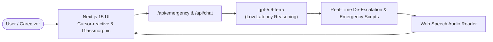

<div align="center">

# IBUKI Circle — Recovery & Prevention Platform

### Real-time GenAI emergency de-escalation, zero-typing interventions & caregiver support under high cognitive load.

[](https://web-delta-three-92.vercel.app)
[](https://hack2skill.com)
[](https://openai.com)

**[Try it live](https://web-delta-three-92.vercel.app)**

</div>

---

## The problem

Individuals navigating substance use disorders and their families face overwhelming distress during acute craving peaks and crisis moments. High cognitive stress makes typing or searching for support nearly impossible. Current resources are often static, text-heavy, or require complex manual navigation when immediate de-escalation is needed most.

## What IBUKI Circle does

- 🔴 **Zero-Typing Emergency Interventions**: 1-tap instant action triggers for craving peaks, panic, and impulse risk without requiring user typing.
- ⚡ **Real-Time De-Escalation Protocols**: Generates 3-step physical and sensory grounding directives tailored to the user's distress state.
- 🗣️ **Emergency Voice Scripts**: Built-in Web Speech API audio synthesis reads crisis scripts aloud to de-escalate stress hands-free.
- 🤝 **Caregiver & Family Support Hub**: Non-confrontational communication scripts, safety check protocols, and family emergency tools.

## See it in 90 seconds

1. **Click 1-Tap Trigger**: Tap *"Intense Craving Peak"* or *"Panic / Anxiety"* on the home dashboard.
2. **Instant De-Escalation**: View the 1-sentence grounding directive, 3-step protocol, and immediate action item.
3. **Listen Aloud / Speak Script**: Click *"🔊 Read Script Aloud"* to play the speech-synthesized voice script hands-free.
4. **Caregiver Mode**: Switch to Caregiver Hub for non-confrontational scripts and family safety check-ins.

## How it works



## AI Stack & Infrastructure

| Component | Usage & Role |
|---|---|
| **`gpt-5.6-terra`** | Low-latency real-time emergency script generation and crisis de-escalation |
| **OpenAI API** | Scalable API key integration with `low` reasoning effort configuration |
| **Next.js 15 App Router** | High-performance React 19 web application framework |
| **Tailwind CSS 4** | Glassmorphic, dark-mode accessible design system |
| **Web Speech API** | Hands-free audio reading of generated emergency scripts |

## Run it locally

```bash
pnpm install
pnpm dev                     # → http://localhost:3000
curl localhost:3000/api/health   # verify health endpoint
```

| Variable | Purpose |
|---|---|
| `OPENAI_API_KEY` | OpenAI API key for `gpt-5.6-terra` calls |
| `OPENAI_BASE_URL` | Region-pinned host (`https://us.api.openai.com/v1`) — required, the default host 404s |

---

<div align="center">

Built at **PromptWars Chennai** by **Sathya T** ([@tsathya98](https://github.com/tsathya98))

</div>
