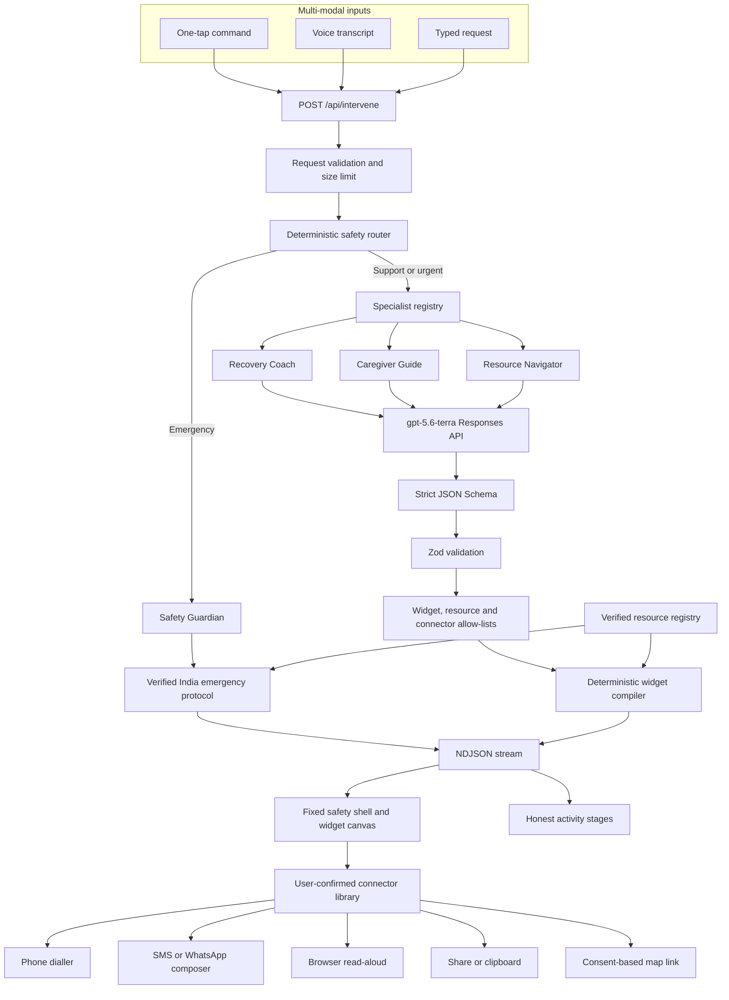

# IBUKI Circle — Functional and Technical Implementation Plan

**Tagline:** *One breath. One tap. Your circle responds.*

## 1. Product Summary

IBUKI Circle is an India-first, GenAI-powered recovery and prevention platform for individuals navigating substance use disorders and their caregivers. It is designed for high-stress moments when typing, searching and making complex decisions become difficult.

The hackathon submission demonstrates three core outcomes:

1. A person can request support without typing.
2. GenAI can produce personalized, actionable intervention scripts.
3. Immediate emergencies are handled deterministically without depending on AI.

IBUKI Circle provides recovery support and safety navigation. It does not diagnose, replace professional treatment, dispatch emergency services or silently contact another person.

> **Document status:** This is the target submission architecture. The jury-facing
> README must list only features that are implemented and verified end-to-end.

---

## 2. Functional Requirements

### P0 — Mandatory submission functionality

#### FR-01: Individual and caregiver modes

The landing experience provides two modes without requiring authentication: **I need support** and **I'm supporting someone**. The selected mode controls command buttons, specialist routing, generated language, resources and connector actions.

#### FR-02: Zero-typing command dock

Persistent, large one-tap commands (six per mode). Individual: strong urge · panic/overwhelmed · close to using · returned to use · I need someone now · possible overdose/danger. Caregiver: possible overdose · they're distressed · help me start a conversation · prepare a supportive message · caregiver self-support · call emergency help. All primary touch targets ≥48px; emergency actions ≈56px.

#### FR-03: Voice intervention

Voice input must: use feature-detected browser speech recognition; display listening/stopped/processing states; always retain a visible one-tap fallback; send the transcript through the same safety pipeline as buttons and text; run emergency phrase detection deterministically before any AI; never persist or log the transcript. Voice is higher priority than typed chat because it directly satisfies the zero-typing requirement.

#### FR-04: Deterministic safety routing

Every request is classified deterministically from the command ID, selected mode and normalized user text. Internal levels: `steady` / `elevated` (support), `urgent`, `emergency`. Emergency phrases (word-boundary matched) include suspected overdose, "took too much", unresponsiveness, stopped breathing, inability to wake, blue lips, seizure, imminent danger and suicide-related language. **The model may not lower a risk level selected by deterministic code.**

#### FR-05: Immediate emergency protocol

For an emergency classification:

1. Do not wait for the model — the verified protocol renders with zero model dependency.
2. Disable decorative motion and collapse the interface to one primary action.
3. Show **Call 112 now**; open the dialler only after explicit user action.
4. Show no more than three supporting safety widgets.
5. Label the result **Verified guidance — not AI-generated**, with source organization and review date.

Verified sources: [ERSS — 112](https://112.gov.in/) · [National Drug De-addiction Helpline — 14446](https://nmba.dosje.gov.in/) · [Tele-MANAS — 14416](https://www.mohfw.gov.in/sites/default/files/Rapid%20Assessment%20report%20on%20TeleMANAS.pdf) · [CDC suspected-overdose response](https://www.cdc.gov/stop-overdose/response/index.html) (emergency calling localized to India's 112).

#### FR-06: Personalized GenAI intervention

Non-emergency requests route to one specialist and one live `gpt-5.6-terra` structured-output call (Responses API, low reasoning effort). The model authors **intent** — acknowledgement, 1–3 immediate steps, optional paced-breathing spec, optional first-person support message, caregiver guidance, allow-listed resource IDs — and a deterministic compiler authors the widgets. All model output passes strict JSON Schema **and** Zod validation before rendering. Invalid output is rejected, never converted into canned AI-like guidance. A "fewer words" mode collapses any script to its essential steps.

#### FR-07: Caregiver playbook

Caregiver guidance contains: say this · avoid saying this · observable warning signs · when to escalate (call 112) · professional-support actions. The content must not diagnose, blame, recommend physical restraint or promise that the situation is safe.

#### FR-08: Verified resource navigation

Every resource includes official name, responsible organization, purpose, phone number where applicable, official URL, last-reviewed date. The model selects only registry IDs and cannot generate phone numbers or provider details.

#### FR-09: Honest connectors

Connector actions: phone dialler · SMS composer · WhatsApp composer · Web Share API · clipboard fallback · browser read-aloud · optional consent-based map link. Allowed states: `prepared` / `opened` / `failed`. The application never claims "message sent", "contact notified" or "emergency team dispatched".

#### FR-10: Read-aloud and fewer-words modes

Generated scripts can be read aloud (pausable/stoppable), reduced to a concise view, copied or shared.

#### FR-11: Honest AI failure

When the AI call fails: state that personalized AI guidance is temporarily unavailable; do not display canned content as AI output; continue showing verified resources; keep emergency and phone actions functional; offer retry.

#### FR-12: Distressed-user accessibility

Keyboard navigation, visible focus states, screen-reader announcements for state changes, `prefers-reduced-motion` support, 320px usability, no shame/streak/guilt/confetti mechanics, no decorative animation in emergency mode, and a pausable breathing pacer as the only permitted distress-state animation.

### P0 additions carried from the merged plan

- **Breathing pacer widget** ships P0 (server-side spec already compiled; static reduced-motion variant included) — it is the sanctioned distress-state animation and a strong personalization proof.
- **Circle message widget** ships P0 — the editable AI-prepared support message with WhatsApp/SMS/share/copy connectors and consent-based location attach is the "connected caregiver workflow" evidence.
- **Compact activity rail** ships P0 — the orchestrator already streams real stage events over NDJSON, so the rail is honest, cheap, and doubles as the loading state.

### P1 — only if time remains

Typed-chat affordance polish · richer context personalization (preferred name, setting, trusted-contact label — schema already supports these).

### P2 — Post-hackathon

Authenticated recovery profiles · Firestore persistence · trusted-circle acknowledgements · provider-directory integrations · reusable MCP connector services · ChatKit conversational shell · analytics and clinical-review workflows.

---

## 3. Architecture and Interfaces

### Three internal libraries

**Specialist Agent Library** (`lib/agents/`) — constrained specialist profiles selected by one orchestrator; not autonomous multi-agent loops.

| Specialist | Responsibility | Model dependency |
|---|---|---|
| Safety Guardian | Immediate emergency protocol | None |
| Recovery Coach | Craving, panic and return-to-use support | One structured call |
| Caregiver Guide | Communication guidance and warning signs | One structured call |
| Resource Navigator | Verified India-first support pathways | One structured call |

**Widget Library** (`components/widget-renderer.tsx` + closed vocabulary in `lib/schemas.ts`): `intervention-script` · `breathing-guide` · `safety-actions` · `circle-message` · `caregiver-guidance` · `verified-resource`. The model produces semantic intent; deterministic React components control layout, colors, actions and connectors. Every widget carries a `source: "ai" | "verified"` label rendered in the UI. Unknown widget types render a visible error block, never silently.

**Connector Library** (`lib/connectors.ts`): pure, unit-tested link builders (tel/SMS/WhatsApp/maps) plus browser actions (share, clipboard, read-aloud, geolocation-with-consent). Each specialist has an explicit widget and connector allow-list; anything outside it is rejected, never substituted.

### Public intervention API

`POST /api/intervene` — one endpoint for every modality (tap, voice transcript, typed text). Request: `{ mode, buttonId?, text?, context? }` (at least one of buttonId/text; trimmed, size-limited, never logged). The response streams NDJSON frames: `{type:"activity", event}` for each real pipeline stage (routing → generation → validation; the client appends its own rendering stage), then `{type:"response", response}` with the validated `AgentResponse` `{ agentId, riskLevel, summary, widgets[], generation: "ai" | "verified-protocol" | "mixed", model }`.

> Serverless note: activity events stream inside the orchestrator's own response because separate SSE-hub endpoints don't share memory across Vercel serverless invocations.

### Data flow

### Technical defaults

Nx 23 monorepo · Next.js 16 App Router · React 19 · Tailwind CSS 4 · Zod at every boundary · OpenAI Responses API with `gpt-5.6-terra` (low reasoning effort) on the region-pinned `https://us.api.openai.com/v1` base URL · one Next.js/Vercel deployment · pnpm through Nx commands · Vitest for focused unit tests · **no** FastAPI, FastMCP, ChatKit, authentication, Redis or external database in the hackathon build.

### Persistence and privacy

`localStorage` only for harmless preferences (mode, display preferences). Do not persist recovery conversations, transcripts, location, crisis history, phone numbers or health information. Firestore is deferred until authentication, consent, deletion and export requirements can be implemented correctly.

### Product visual-design decision

- Background `#071521` · surface `#0F2435` / raised `#163247`
- Primary support actions: low-saturation teal `#5EEAD4`
- Human connection / caregiver: soft indigo `#A5B4FC`
- Attention: amber `#FBBF24` as **small accents and focus ring only**
- Emergency: crimson `#BE123C` strictly for Level-1 states
- WCAG AA contrast, ≥48px targets, `prefers-reduced-motion` everywhere
- Normal mode may use subtle cursor spotlight + particle ambience; emergency mode removes particles, gradients, pulsing indicators and competing actions; no shame mechanics anywhere.

---

## 4. Delivery Plan

| Workstream | Ownership |
|---|---|
| Primary integration | Safety router, orchestrator, widgets, connectors, voice, final integration |
| Documentation | This plan, truthful README, architecture diagram, problem-statement mapping |
| Quality | Fast CI (lint/test/build + production audit + secret scan), Vitest, security headers |
| Skill maintenance | Surgical skill updates, `.claude/skills` → `.agents/skills` sync |

Cut order when time is constrained: typed chat → geolocation → elaborate activity animation → extra widgets → advanced CI actions → internal skill refinements. **Never cut:** deterministic emergency routing, real personalized AI output, individual/caregiver flows, one-tap commands, voice, honest connectors, verified sources, explicit AI-failure behavior.

---

## 5. Test and Acceptance Plan

### Unit tests

Every emergency phrase routes to emergency · craving/panic phrases do not false-positive as overdose · caregiver requests select the Caregiver Guide · the model cannot lower deterministic risk · invalid widget/connector/resource IDs are rejected · registry entries reference valid IDs · phone/SMS/WhatsApp builders encode values safely · malformed structured model output produces the honest verified fallback.

### Evaluator flows

1. **Individual craving:** one tap → Recovery Coach visibly selected → live structured AI response → intervention + breathing + circle-message widgets → read aloud → editable support message opens in WhatsApp/SMS composer → app truthfully reports "opened".
2. **Caregiver concern:** caregiver mode → Caregiver Guide → say/avoid/warning-signs guidance → verified support actions.
3. **Suspected overdose:** tap or voice phrase → Safety Guardian → verified 112 action immediately → no model dependency.
4. **Voice equivalence:** a spoken craving request produces the same routing and widget contract as the equivalent tap.
5. **AI unavailable:** model failure produces an honest unavailable state while verified resources and phone actions remain usable.
6. **Connector truthfulness:** phone/message apps show `opened`/`prepared`; the app never claims delivery.

### Final verification gate

- `pnpm nx lint web` green
- `pnpm nx test web` green
- `pnpm nx build web` green
- Production `/api/health` returns 200 and identifies the active model
- The three mandatory evaluator flows pass on the production URL
- Microphone-denied and AI-failure states are usable
- Keyboard and 320px mobile checks pass
- No `alert(...)`, fake sent states or AI-like hardcoded catch responses remain
- `MOCK` is absent from production code paths
- README lists only shipped features; repository < 10 MB
- `.claude/skills` and `.agents/skills` are synchronized

## Assumptions and Defaults

Project name **IBUKI Circle** · India-first · English for the hackathon · `gpt-5.6-terra` is the only verified model (any other model ID requires a live smoke test before entering code) · no login or test credentials required · no sensitive persistent storage · voice is retained before typed chat when scope must be reduced · emergency guidance is deterministic and source-backed; GenAI remains core to personalized non-emergency interventions.
